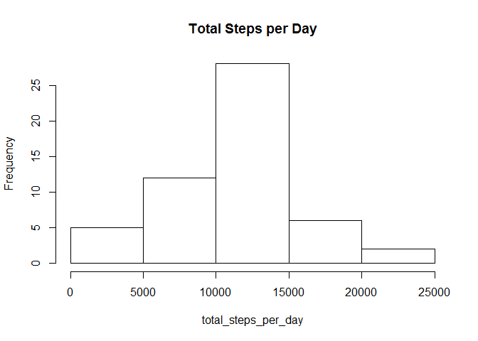
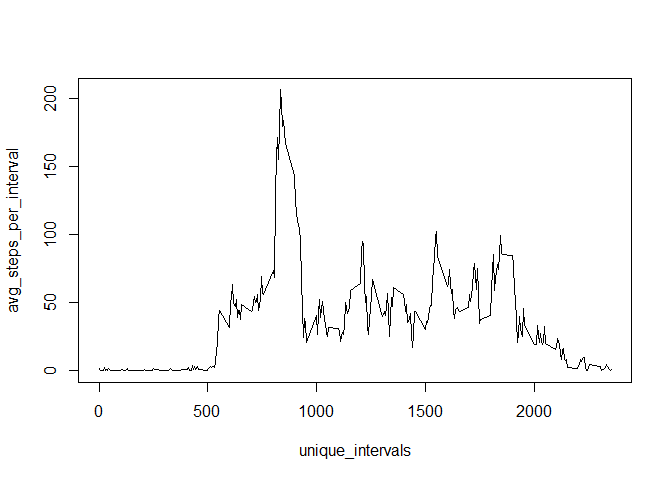
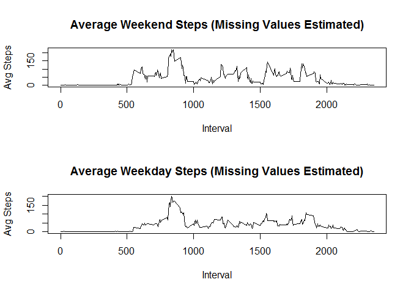

#Reproducible Research Course Project 1

###Load and preprocess the data    

First, read in the data. Then, preprocess the data by removing all NA values from the dataset.


```r
pre_dataset <- read.csv("activity.csv")
dataset <- pre_dataset[!is.na(pre_dataset$steps),]
```

###Mean steps taken per day

Find the total number of steps taken per day. 


```r
unique_dates <- unique(dataset$date)
total_steps_per_day <- c()
for (n in 1:length(unique_dates)) {
  logical <- unique_dates[n]==dataset$date
  temp <- dataset[logical,]
  total_steps_per_day[n] <- sum(temp$steps)
}
steps_table <- data.frame(unique_dates,total_steps_per_day)
```

Create Histogram of total steps taken per day.


```r
hist(total_steps_per_day, main="Total Steps per Day")
```

<!-- -->

Find mean and median of total number of steps taken per day.


```r
mean(total_steps_per_day)
```

```
## [1] 10766.19
```

```r
median(total_steps_per_day)
```

```
## [1] 10765
```

#Average daily activity pattern

Creat line plot, x-axis: 5 minute interval, y-axis:verage number of steps taken, (averaged across all days). 


```r
unique_intervals <- unique(dataset$interval)
avg_steps_per_interval <- c()
for (n in 1:length(unique_intervals)) {
  logical <- unique_intervals[n]==dataset$interval
  temp <- dataset[logical,]
  avg_steps_per_interval[n] <- mean(temp$steps)
}
plot(unique_intervals, avg_steps_per_interval , type="l")
```

<!-- -->

Find interval with maximum number of steps.


```r
logical <- max(avg_steps_per_interval)==avg_steps_per_interval
unique_intervals[logical]
```

```
## [1] 835
```

###Inputing missing values

Find total number of missing values.


```r
total_NAs <- sum(is.na(pre_dataset$steps))
total_NAs
```

```
## [1] 2304
```

Fill in missing (NA) data points with mean data for that interval.


```r
refined_dataset <- pre_dataset
for (n in 1:nrow(refined_dataset)) {
  if ( is.na(refined_dataset$steps[n]) ) { 
      logical <- refined_dataset$interval[n]==unique_intervals
      refined_dataset$steps[n] <- avg_steps_per_interval[logical]
    }
}
```

Using the new dataset, find the total number of steps taken per day. 


```r
unique_dates <- unique(refined_dataset$date)
refined_total_steps_per_day <- c()
for (n in 1:length(unique_dates)) {
  logical <- unique_dates[n]==refined_dataset$date
  temp <- refined_dataset[logical,]
  refined_total_steps_per_day[n] <- sum(temp$steps)
}
refined_steps_table <- data.frame(unique_dates,refined_total_steps_per_day)
```

Create histogram with new dataset.


```r
hist(refined_total_steps_per_day, main="Total Steps per Day (Using New Data Set")
```

<!-- -->

Find mean and meadian of total steps taken.


```r
mean(refined_total_steps_per_day)
```

```
## [1] 10766.19
```

```r
median(refined_total_steps_per_day) 
```

```
## [1] 10766.19
```

Comparing the mean and meidan of the data set with the NA values removed ("processed data set") and the data set with the estimated missing values ("estimated data set"), the two data sets have the same mean, but slightly different medians. After inspecting the code to make sure the program was functioning as inteded, it seems that adding so many values at the day's mean did not have an impact on the total mean and median for that day. In the estimated data set, the mean and the median are equal.    

Comparing the total number of steps in the two data sets, there are more dates in the estimated data set, since some days had only NA values in the processed data set.

###Difference between weekday and weekend

Create new variable indicating weekeday or weekend.


```r
weekend <- weekdays(as.Date(dataset$date))=="Saturday" | weekdays(as.Date(dataset$date))=="Sunday"
weekday <- !weekend

dataset_weekend <- refined_dataset[weekend,]
dataset_weekday <- refined_dataset[weekday,]

unique_intervals <- unique(dataset$interval)
avg_steps_per_interval_weekend <- c()
for (n in 1:length(unique_intervals)) {
  logical <- unique_intervals[n]==dataset_weekend$interval
  temp <- dataset_weekend[logical,]
  avg_steps_per_interval_weekend[n] <- mean(temp$steps)
}

unique_intervals <- unique(dataset$interval)
avg_steps_per_interval_weekday <- c()
for (n in 1:length(unique_intervals)) {
  logical <- unique_intervals[n]==dataset_weekday$interval
  temp <- dataset_weekday[logical,]
  avg_steps_per_interval_weekday[n] <- mean(temp$steps)
}

par(mfrow=c(2,1))
plot(unique_intervals,avg_steps_per_interval_weekend,type="l",main="Average Weekend Steps (Missing Values Estimated)",xlab="Interval",ylab="Avg Steps")
plot(unique_intervals,avg_steps_per_interval_weekday,type="l",main="Average Weekday Steps (Missing Values Estimated)",xlab="Interval",ylab="Avg Steps")
```

<!-- -->


